# Kiến trúc mã nguồn — Đấu Sĩ (fighter)

Tài liệu này dành cho người đọc/sửa code. Hướng dẫn chơi và cách thêm nhân vật
xem [README.md](README.md).

> Sơ đồ viết bằng Mermaid — hiển thị trực tiếp trên GitHub, GitLab và VS Code
> (bản xem trước Markdown).

---

## Mục lục

1. [Tổng quan](#1-tổng-quan)
2. [Cấu trúc thư mục & trách nhiệm từng tầng](#2-cấu-trúc-thư-mục--trách-nhiệm-từng-tầng)
3. [Phụ thuộc giữa các tầng](#3-phụ-thuộc-giữa-các-tầng)
4. [Các cây kế thừa chính](#4-các-cây-kế-thừa-chính)
5. [Vòng đời chương trình](#5-vòng-đời-chương-trình)
6. [Một frame chạy như thế nào](#6-một-frame-chạy-như-thế-nào)
7. [Luồng màn hình (Scene)](#7-luồng-màn-hình-scene)
8. [Luật trận — BattleScene](#8-luật-trận--battlescene)
9. [Thế giới trận đấu — Arena::Update](#9-thế-giới-trận-đấu--arenaupdate)
10. [Nhân vật — Fighter](#10-nhân-vật--fighter)
11. [Từ phím bấm đến đòn đánh](#11-từ-phím-bấm-đến-đòn-đánh)
12. [Đòn đánh: MoveDef, combo, va chạm](#12-đòn-đánh-movedef-combo-va-chạm)
13. [Đạn và vùng sát thương](#13-đạn-và-vùng-sát-thương)
14. [Sự kiện → âm thanh và chữ trên màn hình](#14-sự-kiện--âm-thanh-và-chữ-trên-màn-hình)
15. [Vẽ một khung hình](#15-vẽ-một-khung-hình)
16. [Tài nguyên: sprite, âm thanh, font](#16-tài-nguyên-sprite-âm-thanh-font)
17. [AI](#17-ai)
18. [Hằng số quan trọng](#18-hằng-số-quan-trọng)
19. [Mở rộng](#19-mở-rộng)
20. [Điểm cần lưu ý & nợ kỹ thuật](#20-điểm-cần-lưu-ý--nợ-kỹ-thuật)

---

## 1. Tổng quan

| | |
|---|---|
| Ngôn ngữ | C++17 (game) + C99 (font tiếng Việt dùng chung, raylib) |
| Thư viện | raylib 6.1-dev — cửa sổ, đồ hoạ 2D, âm thanh |
| Quy mô | **50 file, ~8.100 dòng** (chưa kể raylib và `common/`) |
| Canvas ảo | 1280 × 720, letterbox ra cửa sổ thật |
| Hai cách chạy | Độc lập (`src/main.cpp`) hoặc nhúng trong Arcade Hub (`fighter_runner.h`, API kiểu C) |

Phân bổ mã nguồn theo tầng:

| Tầng | Thư mục | Dòng | Vai trò |
|---|---|---:|---|
| Ứng dụng | `Game.*`, `main.cpp`, `fighter_runner.*` | ~250 | Vòng lặp, quản lý scene, cầu nối với Hub |
| Nền tảng | `core/` | ~1.500 | Tài nguyên, animation, input, AI, âm thanh, font |
| Mô phỏng | `entities/` | ~2.750 | Võ sĩ, đòn đánh, đạn, hạt, thế giới trận |
| Nội dung | `characters/` | ~1.650 | Danh mục + 4 nhân vật + 6 loại đạn |
| Hiển thị | `render/` | ~530 | Nền parallax, HUD, bảng chiêu |
| Màn hình | `scenes/` | ~1.430 | Tiêu đề, chọn nhân vật, trận đấu |

Riêng `entities/Fighter.cpp` (~1.400 dòng) chiếm gần 1/5 toàn bộ — đó là lõi
của hệ thống chiến đấu (xem [mục 20](#20-điểm-cần-lưu-ý--nợ-kỹ-thuật)).

---

## 2. Cấu trúc thư mục & trách nhiệm từng tầng

`inc/` và `src/` có cùng cấu trúc thư mục con. Header chung nằm ở `inc/`,
header chỉ dùng nội bộ (ví dụ `MoveHelpers.hpp`) nằm cạnh file `.cpp`.

```
fighter/
├── inc/ , src/
│   ├── Game.hpp/.cpp          Vỏ ứng dụng: MatchConfig, scene hiện tại, nền dùng chung
│   ├── main.cpp               Chạy độc lập: cửa sổ, canvas ảo, letterbox
│   ├── fighter_runner.h/.cpp  4 hàm extern "C" cho Arcade Hub
│   │
│   ├── core/                  ── NỀN TẢNG (không biết gì về luật đối kháng) ──
│   │   ├── Config.hpp         Hằng số: canvas, sàn đấu, trọng lực, camera
│   │   ├── Assets             Singleton: dò thư mục assets, cache texture
│   │   ├── Animation          Animation (dải sprite) + Animator (đoạn frame, phát ngược)
│   │   ├── Input              InputState, KeyBindings, InputBuffer (lệnh quay tay),
│   │   │                      Controller / HumanController / DummyController
│   │   ├── AI                 AIController (máy đánh)
│   │   ├── Difficulty         Bảng 4 mức độ khó
│   │   ├── Audio              Singleton: ngân hàng hiệu ứng, xướng ngôn, nhạc, tổng hợp âm
│   │   └── Text               Bọc font tiếng Việt (C) cho phía C++
│   │
│   ├── entities/              ── MÔ PHỎNG TRẬN ĐẤU ──
│   │   ├── Move.hpp           MoveId, MoveDef (frame data), HitHeight, SlashFx...
│   │   ├── Events.hpp         GameEvent + EventQueue
│   │   ├── Fighter            Lớp cơ sở trừu tượng của mọi võ sĩ
│   │   ├── Projectile         Lớp cơ sở của mọi loại đạn
│   │   ├── Particles          Hệ hạt: tia sáng va chạm, bụi, khói, sét...
│   │   └── Arena              Thế giới: 2 võ sĩ, đạn, va chạm, camera, tường
│   │
│   ├── characters/            ── NỘI DUNG ──
│   │   ├── Roster             CharacterDef + danh mục nhân vật (dữ liệu)
│   │   ├── Characters.hpp     Khai báo 4 lớp nhân vật + 6 lớp đạn
│   │   ├── Samurai/Kenji/Knight/Wizard.cpp   Mỗi nhân vật một file
│   │   ├── Projectiles.cpp    Cài đặt 6 loại đạn
│   │   └── MoveHelpers.hpp    ByStrength, SpecialBase, SuperBase (nội bộ)
│   │
│   ├── render/                ── HIỂN THỊ (chỉ đọc trạng thái, không sửa) ──
│   │   ├── Background         6 lớp parallax + sàn gỗ
│   │   ├── Hud                Thanh máu, Super 2 nấc, đồng hồ, combo, chữ bật lên
│   │   └── MoveList           Bảng chiêu
│   │
│   └── scenes/                ── MÀN HÌNH ──
│       ├── Scene.hpp          Lớp cơ sở
│       ├── TitleScene         Menu chính
│       ├── SelectScene        Chọn nhân vật + độ khó + số hiệp + chế độ ("Settings")
│       └── BattleScene        Luật trận, âm thanh, cut-in, tạm dừng, luyện tập
│
└── ../assets/fighter/         Sprite, nền, âm thanh (CC0) — xem LICENSES.md
```

---

## 3. Phụ thuộc giữa các tầng

Mũi tên `A --> B` nghĩa là "A include / gọi B". Phụ thuộc chỉ đi **một chiều từ
trên xuống**: `core/` không biết `entities/`, `entities/` không biết `scenes/`,
`render/` không bao giờ sửa trạng thái trận.

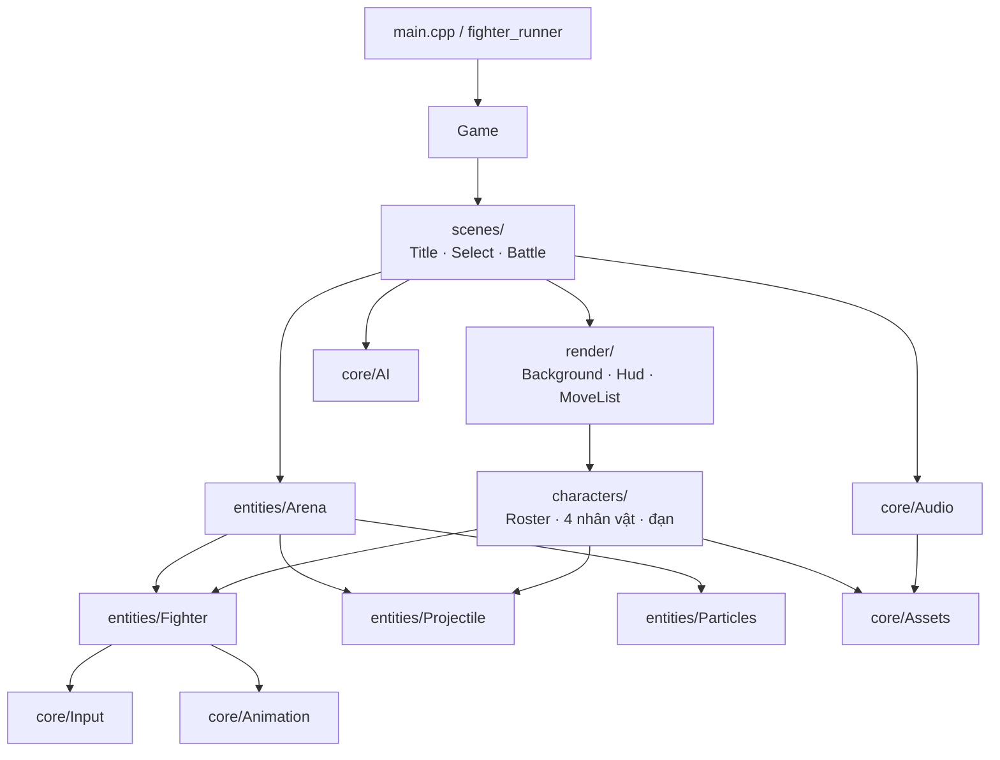

Có một chỗ phụ thuộc hai chiều có chủ đích: `Fighter` và `Arena` gọi lẫn nhau.
`Arena` gọi `Fighter::Update`, còn `Fighter` cần `Arena&` để bắn đạn, tạo hiệu
ứng, đẩy sự kiện. Hai header chỉ khai báo trước (forward declare) lẫn nhau, còn
file `.cpp` mới include đầy đủ.

---

## 4. Các cây kế thừa chính

Bốn "điểm đa hình" của chương trình. Mỗi cây cho phép thêm loại mới mà không
sửa code gọi nó.

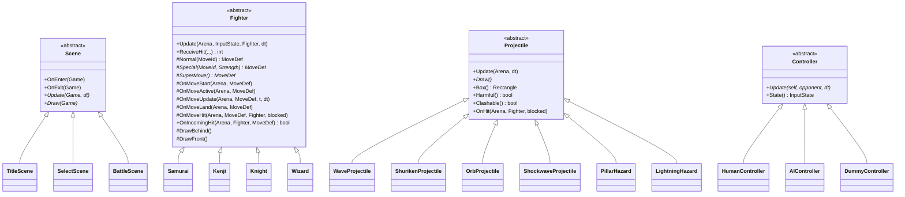

Ba **singleton** giữ tài nguyên dùng chung suốt đời chương trình:
`Assets` (texture), `Audio` (âm thanh), `Roster` (danh mục nhân vật).

**Quy ước đặt tên** trong `Fighter`: hàm `public` là API cho `Arena`/scene;
hàm `protected virtual` là "móc" cho lớp con; hàm `private` là máy trạng thái
chung mà lớp con không được đụng vào.

---

## 5. Vòng đời chương trình

### Hai điểm vào

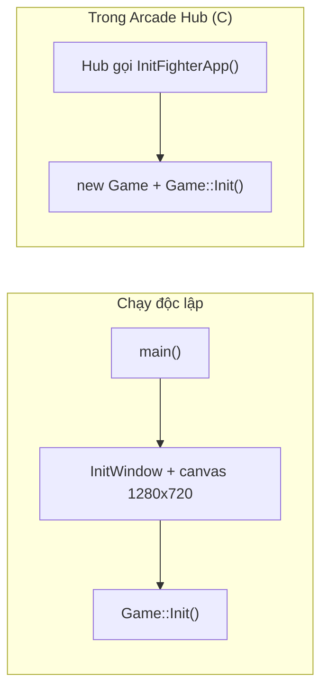

Hub tự lo cửa sổ, canvas, letterbox và **đã mở sẵn thiết bị âm thanh**.
`fighter_runner.cpp` chỉ chuyển tiếp `Init/Update/Draw/Close`.

### Khởi tạo — `Game::Init()`

| Bước | Việc | Ghi chú |
|---|---|---|
| 1 | `TextInit()` | Font tiếng Việt (có đếm tham chiếu, dùng chung với Hub) |
| 2 | `Audio::Init()` | Mở thiết bị âm thanh **chỉ khi chưa ai mở**, nhớ lại mình có "sở hữu" không |
| 3 | `Roster::Load()` | Tạo 4 `CharacterDef`, nạp 8 dải sprite cho mỗi nhân vật |
| 4 | `Background::Load()` | 6 lớp ảnh parallax |
| 5 | Vào `TitleScene` | |

### Giải phóng — `Game::Shutdown()` (thứ tự **bắt buộc**)

```
scene_.reset()        ← Fighter giữ tham chiếu tới CharacterDef trong Roster
Roster::Unload()      ← CharacterDef giữ handle texture của Assets
Audio::Shutdown()     ← chỉ đóng thiết bị âm thanh nếu chính game đã mở nó
Assets::UnloadAll()
TextShutdown()
```

Đảo thứ tự sẽ để lại con trỏ/handle "chết". Lỗi này từng xảy ra thật: vào game
từ Hub lần thứ hai thì vẽ bằng texture đã bị xoá. `Roster::Unload()` sinh ra để
sửa đúng lỗi đó.

---

## 6. Một frame chạy như thế nào

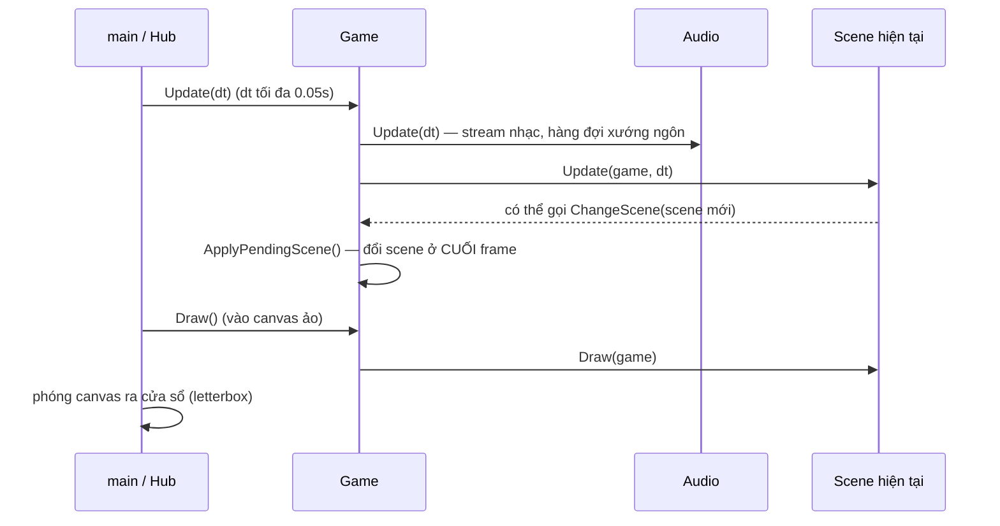

**Vì sao đổi scene ở cuối frame?** Nếu `BattleScene::Update` gọi `ChangeScene`
mà scene cũ bị xoá ngay, hàm đang chạy sẽ tiếp tục trên một đối tượng đã chết.
`ChangeScene` chỉ lưu scene mới vào `pending_`; `ApplyPendingScene()` mới gọi
`OnExit` / `OnEnter` và hoán đổi.

---

## 7. Luồng màn hình (Scene)

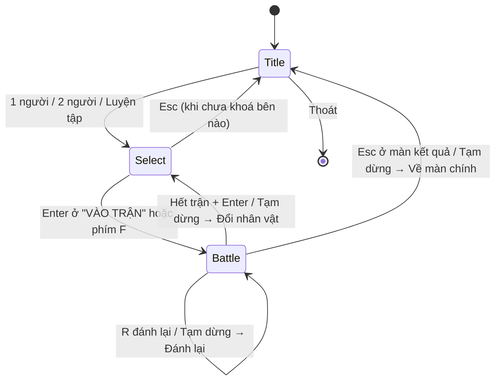

Dữ liệu truyền giữa các màn chỉ đi qua **`MatchConfig`** trong `Game`
(nhân vật hai bên, độ khó, số hiệp, 2 người hay không, luyện tập, bật khung va
chạm). Scene không giữ tham chiếu lẫn nhau.

`SelectScene` tự chia trang theo `Roster::Count()`: thêm nhân vật không phải sửa
giao diện.

---

## 8. Luật trận — BattleScene

`BattleScene` sở hữu một `Arena`, một `Hud`, hai `Controller`. Nó quyết định
**luật** (hiệp, giờ, thắng thua), còn `Arena` lo **vật lý**.

### Chọn controller khi vào trận (`OnEnter`)

| Chế độ | Bên trái (P1) | Bên phải (P2) |
|---|---|---|
| 1 người | `HumanController(PlayerOneSolo)` — WASD **hoặc** mũi tên | `AIController(độ khó)` + chỉnh hệ số sát thương/Super theo độ khó |
| 2 người | `HumanController(PlayerOne)` — chỉ WASD | `HumanController(PlayerTwo)` — mũi tên + numpad |
| Luyện tập | `HumanController(PlayerOneSolo)` | `DummyController` (đứng / ngồi / tự đỡ / nhảy) |

### Các pha của một trận

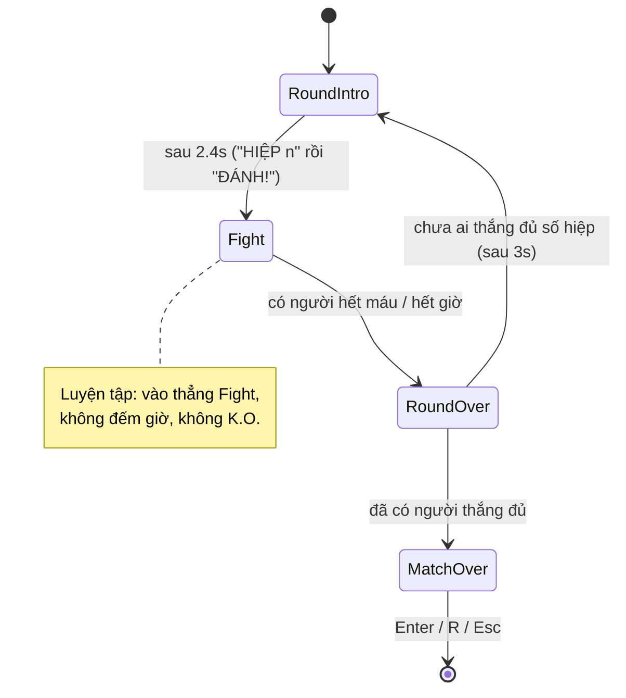

| Pha | Input | Việc chính |
|---|---|---|
| `RoundIntro` | khoá | Nhân vật diễn tư thế mở màn (hiệp 1); xướng ngôn "Round n" / "Final round", rồi "Fight" |
| `Fight` | mở | Đồng hồ **đứng yên khi đang khựng hình** (hitstop / siêu chiêu). Kiểm tra K.O. và hết giờ |
| `RoundOver` | khoá | 1.1s đầu quay chậm 30% + zoom 1.12×, rồi trả tốc độ. Kiểm tra "Flawless" |
| `MatchOver` | khoá | Bảng kết quả, xướng ngôn "You win / You lose" hoặc "Player n · Winner" |

**Tạm dừng** (`P`/`Esc`) chặn toàn bộ `Update` của trận; menu có mục **Bảng chiêu**.

---

## 9. Thế giới trận đấu — `Arena::Update`

Đây là trái tim của mô phỏng. Thứ tự dưới đây có ý nghĩa, đừng đảo tuỳ tiện.

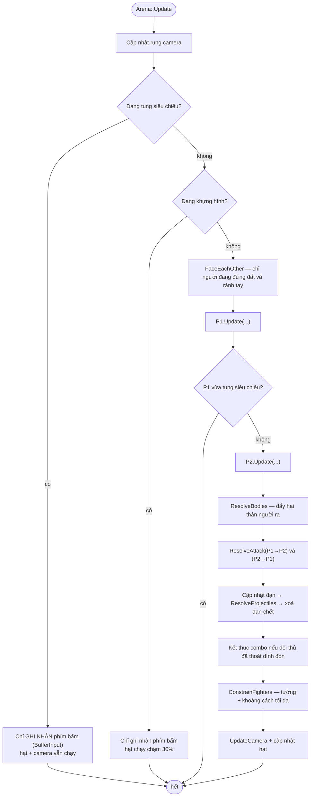

**Vì sao vẫn ghi nhận phím trong lúc khựng hình?** Người chơi hay bấm nối combo
đúng lúc hình đang khựng. Nếu bỏ qua input, phím bị "nuốt" và combo không nối
được. `BufferInput` chỉ ghi phím, không cho thời gian trôi, nên phím bấm lúc
khựng vẫn còn "tươi" khi trận chạy tiếp.

**Camera**: bám điểm giữa hai võ sĩ trên sàn rộng 2240px, phóng to 1.32× và neo
tại mặt đất (đường sàn của thế giới luôn trùng đường sàn của nền vẽ). Hai người
không được cách nhau quá `kMaxSeparation`: ai đang đi ra xa sẽ bị chặn lại.

---

## 10. Nhân vật — Fighter

### Máy trạng thái

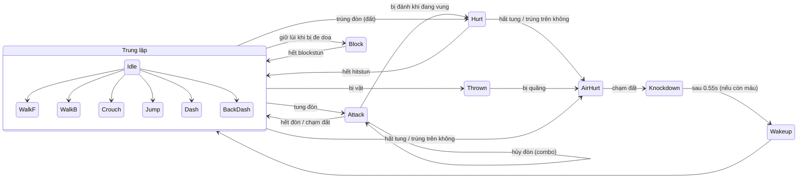

Ngoài sơ đồ còn `Intro` (tư thế mở màn), `Victory`, `Defeat`. Khi hết hiệp,
`frozen_ = true`: không nhận lệnh nữa, **nhưng người đang bay vẫn rơi xuống**
(nếu không, người trúng đòn kết liễu giữa không trung sẽ bị treo lơ lửng).

### Thứ tự trong `Fighter::Update`

1. Đếm giờ các bộ hẹn (`clock_`, hitstun, blockstun, bất tử, hiệu ứng nháy...)
2. `ReadInput` — ghi phím, cập nhật `InputBuffer`, phát hiện nhấn đúp để lướt
3. Xử lý theo trạng thái (`switch (state_)`): trung lập → `UpdateNeutral`, đang
   đánh → `UpdateAttack` hoặc `UpdateThrowHold`, ngã → đếm giờ đứng dậy...
4. `UpdatePhysics` — trọng lực, tiếp đất (chuyển trạng thái khi chạm sàn), ma sát
5. `UpdateCharacter` — móc riêng của lớp con (bóng mờ, hàng đợi tia sét...)
6. `UpdateAnimation` — chọn animation theo trạng thái, nén dọc khi ngồi, nghiêng khi lộn nhào

### Tư thế dựng lại từ 8 dải sprite

Pack CC0 chỉ có `idle, run, jump, fall, attack1, attack2, takehit, death`.
Mọi tư thế khác được dựng lại:

| Tư thế | Cách làm | Ở đâu |
|---|---|---|
| Ngồi | idle nén dọc còn 72% | `UpdateAnimation` → `squash_` |
| Đi lùi | run **phát ngược**, chậm lại — chân bước lùi khớp hướng đi | `PlayMode::reverse` |
| Đứng dậy | death phát ngược nhanh 2.4× | `Knockdown → Wakeup` |
| Đỡ đòn | frame idle đứng yên + lá chắn vẽ bằng code | `Draw()` |
| Đòn nhẹ | nửa đầu của attack1 | `NormalProfile::lightTo` |
| Lộn nhào khi bị tung | xoay sprite quanh thân theo vận tốc rơi | `tilt_` |
| Xoay kiểu Tatsumaki | lật hình liên tục, không đổi hướng logic | `MoveDef::spin` |

---

## 11. Từ phím bấm đến đòn đánh

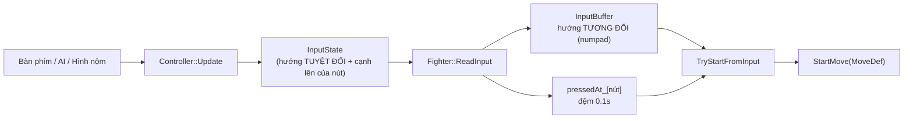

**Mọi nguồn điều khiển đi chung một đường.** `Fighter` không bao giờ gọi
`IsKeyDown`: người thật, AI và hình nộm đều chỉ tạo ra `InputState`. Máy không
có "đường tắt" nào mà người chơi không có.

**Ký hiệu numpad tương đối**: `6` luôn là "tiến về phía đối thủ", bất kể nhân
vật quay trái hay phải. Nhờ vậy lệnh `236` đúng ở cả hai phía màn hình.

```
7 8 9     ↖ ↑ ↗
4 5 6  =  ← · →      (→ = tiến)
1 2 3     ↙ ↓ ↘
```

**Nhận diện lệnh quay tay** (`InputBuffer::Motion`): lịch sử lưu *mỗi lần hướng
thay đổi*; khớp chuỗi từ mới nhất về cũ nhất. Có ba điểm nới lỏng cho bàn phím:
- ký tự `2` chấp nhận mọi hướng có "xuống" (1/2/3);
- cho phép lỡ nhả phím hướng một nhịp (< 0.15s) trước khi bấm đòn;
- cửa sổ thời gian tính theo lúc hướng được **nhả ra**, nên ngồi giữ `↓` lâu rồi
  mới quay `↘→` vẫn thành `236`.

### Thứ tự ưu tiên trong `TryStartFromInput`

| Ưu tiên | Kiểm tra | Kết quả |
|---:|---|---|
| 1 | Nút Super, hoặc `236236` + đòn, và đủ 1 thanh | Siêu chiêu |
| 2 | Đòn + `623` / `214` / `236` / `252` (thử theo thứ tự này) | Chiêu C / B / A / D, lực theo nút L/M/H |
| 2b | Nút Special + hướng (6 → B, 2 → C, 4 → D, còn lại → A) | Chiêu, lực vừa |
| 3 | L + M cách nhau < 0.08s, đang đứng đất | Vật |
| 4 | Đòn thường theo tư thế (trên không / ngồi / đứng) | Normal |

Hàm này được gọi ở **hai chỗ**: lúc trung lập (tung đòn mới), và trong lúc đang
đánh với `cancelling = true` (hủy đòn để nối combo, xem mục sau).

---

## 12. Đòn đánh: MoveDef, combo, va chạm

### MoveDef — một đòn là dữ liệu, không phải code

`MoveDef` (`entities/Move.hpp`) mô tả trọn một đòn: animation và đoạn frame, 3
pha thời gian, hitbox, sát thương, độ cao đòn, quyền hủy đòn, vận tốc, khoảng
bất tử, giáp, hiệu ứng, âm thanh. Lớp nhân vật chỉ việc **điền số**.

```
|<-- startup -->|<-- active -->|<-------- recovery -------->|
   vung tay        hitbox bật          thu đòn (dễ bị phạt)
                ^
                OnMoveActive: bắn đạn, dịch chuyển, vọt lên...
```

Tốc độ animation được co giãn để **đoạn frame khớp đúng tổng thời gian đòn**:
hình và hitbox luôn đi cùng nhau, dù cùng một dải sprite dùng cho đòn nhanh hay chậm.

### Hủy đòn — nền tảng của combo

Trong `UpdateAttack`, nếu đòn đã **chạm** đối thủ (trúng hoặc bị đỡ) và còn
trong cửa sổ hủy thì thử `TryStartFromInput(cancelling = true)`:

| Đang ra | Được hủy sang | Điều kiện |
|---|---|---|
| Đòn thường `chainable` | Đòn thường **mạnh hơn** (hoặc nhẹ → nhẹ) | chạm đối thủ, đứng đất |
| Đòn thường `specialCancel` | Chiêu đặc biệt | chạm đối thủ |
| Đòn có `superCancel` | Siêu chiêu | chạm đối thủ + đủ thanh |

Ví dụ combo chuẩn: `J → K → L → ↓↘→+L` (đã kiểm chứng nối được với cả 4 nhân vật).

### Xử lý một cú đánh — `Arena::ResolveAttack`

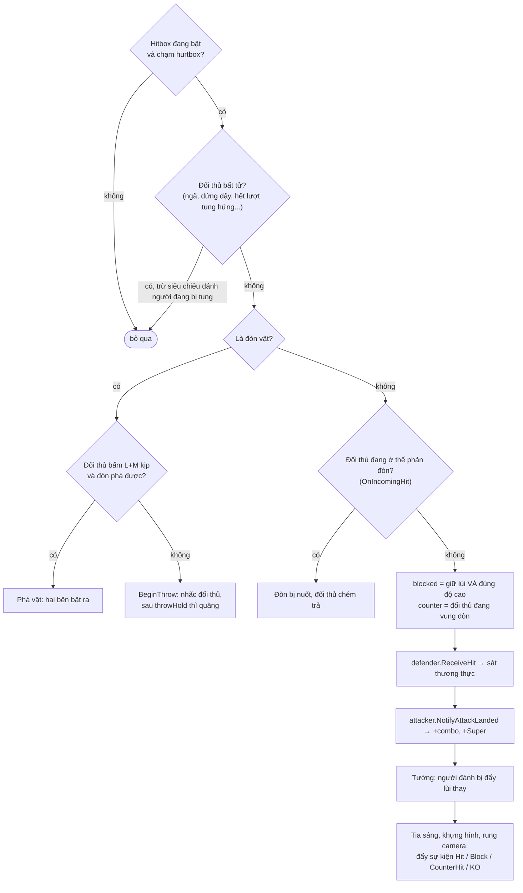

**Độ cao đòn quyết định cách đỡ**:

| `HitHeight` | Đứng đỡ (giữ `←`) | Ngồi đỡ (giữ `↙`) |
|---|:---:|:---:|
| `Mid` | ✓ | ✓ |
| `Low` (quét chân, đòn ngồi nhẹ) | ✗ | ✓ |
| `Overhead` (đòn nhảy, bổ nhào) | ✓ | ✗ |
| `Throw` | ✗ | ✗ |

**Sát thương thực** trong `Fighter::ReceiveHit`:

```
sát thương = damage × hệ số combo × phòng thủ nhân vật × hệ số độ khó × (1.2 nếu counter)
hệ số combo = 1.0 cho 2 hit đầu, sau đó 1 − 0.1 × số hit (tối thiểu 0.3; siêu chiêu tối thiểu 0.5)
bị đỡ     → chỉ mất "chip" (mặc định 1/6 sát thương với chiêu đặc biệt / siêu chiêu), có thể chết vì chip
có giáp   → vẫn mất máu nhưng không khựng, tiếp tục đòn
```

**Tung hứng có giới hạn**: đòn hất tung (`launcher`) cho phép thêm 3 đòn trên
không; hết lượt thì người bị tung trở nên bất tử tới khi chạm đất. Cách này chặn
combo vô hạn.

---

## 13. Đạn và vùng sát thương

Mọi thứ tách khỏi người nhân vật đều là `Projectile`. `Arena` chỉ cần
`Update`, `Draw`, `Box`, `Harmful`, `Clashable`, `OnHit`.

| Lớp | Của | Đặc điểm |
|---|---|---|
| `WaveProjectile` | Mack | Khí kiếm lưỡi liềm; bản siêu chiêu to hơn, làm ngã |
| `ShurikenProjectile` | Kenji | Bay rất nhanh, có quỹ đạo chéo khi ném trên không |
| `OrbProjectile` | Malthus | Cầu năng lượng, tốc độ theo lực |
| `ShockwaveProjectile` | Gareth | Chạy sát đất, nhảy lên là né được, không va với đạn khác |
| `PillarHazard` | Malthus | Báo trước 0.32s rồi trồi lên ở xa, hất tung |
| `LightningHazard` | Malthus (siêu) | Báo trước rồi giáng sét; siêu chiêu gọi 5 tia **đuổi theo** đối thủ |

Luật trong `Arena::ResolveProjectiles`:
1. Hai đạn **khác chủ** và cùng `Clashable()` chạm nhau → cả hai mất một lượt (triệt tiêu).
2. Đạn chạm võ sĩ → đỡ theo **vị trí quả đạn** (`WantsToBlockFrom(x)`), không theo vị trí người bắn.
3. Đạn đánh dấu `MarkSuper()` được đánh trúng người đang bị tung hứng, và hưởng
   mức giảm sát thương combo nhẹ hơn.

Giới hạn "mỗi lúc một quả đạn" nằm ở `CanUseSpecial` của từng nhân vật (đếm
bằng `Arena::CountProjectiles`).

---

## 14. Sự kiện → âm thanh và chữ trên màn hình

Phần mô phỏng (`Arena`, `Fighter`, `Projectile`) **không phát âm thanh và
không vẽ chữ**. Chúng chỉ đẩy `GameEvent` vào hàng đợi. Cuối mỗi frame,
`BattleScene::HandleEvents` đọc ra, rồi xoá hàng đợi.

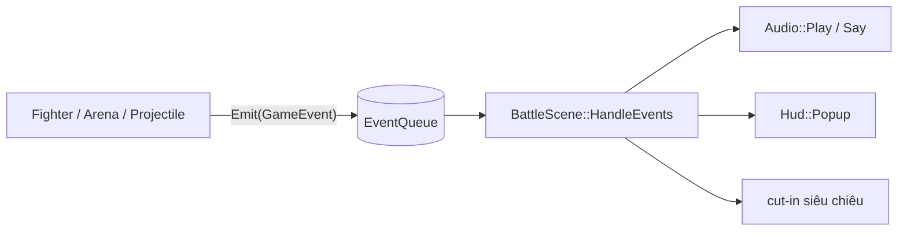

| Sự kiện | Âm thanh | Hiển thị |
|---|---|---|
| `MoveStart` | tiếng gió nhẹ/vừa/nặng (+ tiếng hét nếu đòn có `voice`) | |
| `SpecialStart` / `SuperStart` | tiếng hét; siêu chiêu thêm tiếng trống | cut-in tên siêu chiêu |
| `Hit` / `CounterHit` | tiếng va chạm theo lực (+ tiếng rên ngẫu nhiên) | "COUNTER" |
| `Block` / `Throw` / `ThrowTech` | tiếng đỡ / vật / phá vật | "PHÁ VẬT" |
| `Counter` | tiếng kim loại | "PHẢN ĐÒN!" |
| `Projectile` / `Clash` / `Thunder` / `Teleport` | tiếng tổng hợp bằng code | |
| `Jump` / `Land` / `Dash` / `Knockdown` | tiếng vải / bước chân / ngã | |

K.O., "Round", "Fight", "You win"... do `BattleScene` phát trực tiếp theo pha
trận, không qua hàng đợi.

**Lợi ích của cách tách này**: chạy `Arena` trong bộ kiểm thử không cần âm thanh
hay giao diện; đổi toàn bộ âm thanh không phải chạm vào code chiến đấu.

---

## 15. Vẽ một khung hình

Thứ tự vẽ trong `BattleScene::Draw` (lớp dưới vẽ trước):

| # | Lớp | Không gian toạ độ | Ghi chú |
|---:|---|---|---|
| 1 | Nền parallax + sàn | màn hình (chỉ rung theo camera) | 6 lớp cuộn theo `CameraX` với tốc độ khác nhau |
| 2 | Lớp tối khi tung siêu chiêu | màn hình | |
| 3 | **Thế giới** trong `BeginMode2D(arena.Camera())` | thế giới, phóng 1.32× | bóng → 2 võ sĩ (người đang đánh vẽ sau) → vệt chém → đạn → hạt |
| 4 | Chớp trắng K.O. | màn hình | |
| 5 | HUD | màn hình | thanh máu, đồng hồ, Super, combo, chữ bật lên |
| 6 | Cut-in siêu chiêu | màn hình | |
| 7 | Chữ lớn giữa màn | màn hình | HIỆP n · ĐÁNH! · K.O. · HẾT GIỜ |
| 8 | Kết quả / luyện tập / tạm dừng | màn hình | |

**Chế độ trộn màu**: tia sáng, năng lượng, hào quang dùng blend **cộng sáng**
(`BLEND_ADDITIVE`); bụi, khói và **vệt chém** dùng blend thường. Vệt chém từng
dùng cộng sáng nhưng trên nền hoàng hôn sáng thì cháy thành một mảng trắng.

---

## 16. Tài nguyên: sprite, âm thanh, font

**Dò thư mục** (`Assets::ResolveRoot`): thử lần lượt vài đường dẫn tương đối
(`../assets/fighter/`, `../../assets/fighter/`...) tới khi thấy thư mục
`characters`. Nhờ vậy chạy từ `build/`, từ gốc repo hay từ Hub đều được.

**Sprite** (`Roster::LoadAnims`): mỗi nhân vật 8 file theo tên cố định. **Số frame
suy ra từ kích thước ảnh** (mỗi frame vuông, cạnh bằng chiều cao dải), nên đổi
pack khác số frame vẫn chạy. Lọc `POINT` để phóng to pixel-art không nhoè.

**Làm dịu vệt chém vẽ sẵn**: 3/4 pack vẽ sẵn vệt chém trắng đặc trong frame đòn
đánh. Phóng to 4–5 lần nó thành mảng trắng lấn át nhân vật. Lúc nạp,
`SoftenSlash` làm các điểm ảnh đó hơi trong suốt và ngả màu nhân vật. File PNG
gốc **không bị sửa**. Frame bắt đầu có vệt chém khai báo ở `NormalProfile::slashFrom`.

**Âm thanh** (`Audio::Init`):
- mỗi hiệu ứng là một "ngân hàng" nhiều biến thể; mỗi biến thể có 4 *alias*
  (`LoadSoundAlias`) để phát chồng; mỗi lần phát đổi cao độ ±6% cho đỡ lặp;
- tiếng gió vung đòn, phép thuật, va đạn, sét, dịch chuyển, siêu chiêu được
  **tổng hợp bằng code** (nhiễu trắng qua bộ lọc quét tần số, sóng sin quét);
- nhạc nền ở định dạng QOA (nén của raylib), menu dùng chung bản nhạc nhưng nhỏ hơn;
- máy không có thiết bị âm thanh thì game chạy câm, không lỗi.

**Font**: dùng lại `common/font_vn.c` (C) qua `core/Text`. Font này nạp một danh
sách ký tự cố định. Các mũi tên chéo `↖↗↘↙` và `∞` được thêm vào danh sách đó
để hiển thị lệnh quay tay.

---

## 17. AI

`AIController` (`core/AI.cpp`) chỉ tạo `InputState`, đúng như người chơi. Nó
đọc những gì "mắt người thấy được": khoảng cách, đối thủ đang vung đòn gì (độ
cao đòn), đang nhảy hay không, có đạn bay tới không.

Mỗi frame AI xét theo thứ tự:

1. **Đang chạy kịch bản** (combo, chiêu, vật...) → bấm tiếp theo lịch.
2. **Phòng thủ**: khi đối thủ bắt đầu vung đòn hoặc có đạn tới, tung xúc xắc
   `blockChance`, chờ `reaction` giây rồi giữ lùi. Ngồi đỡ đòn thấp, đứng đỡ đòn trên.
3. **Chống nhảy**: đối thủ lao xuống trong tầm → chiêu vọt lên (Kenji dùng đòn mạnh đứng).
4. **Quyết định theo khoảng cách** mỗi `reaction` giây:
   - gần: combo `L→M→H→chiêu/siêu chiêu`, vật, Gareth dùng vật lệnh;
   - vừa: tiến, nhảy vào, chiêu tiếp cận (Kenji lướt, Gareth húc), Malthus trồng cột và lùi;
   - xa: bắn đạn (Mack, Malthus, Kenji) hoặc tiến vào.

Chiêu đặc biệt được bấm bằng **lệnh quay tay thật** (từng hướng cách nhau 0.03s)
hoặc nút Special, qua đúng `InputBuffer` như người chơi.

Toàn bộ khác biệt giữa các độ khó nằm trong một bảng ở `core/Difficulty.cpp`:
`reaction`, `aggression`, `blockChance`, `comboChance`, hệ số sát thương AI phải
chịu, hệ số hồi Super.

---

## 18. Hằng số quan trọng

| Hằng số | Giá trị | Ở đâu | Ý nghĩa |
|---|---|---|---|
| `kCanvasWidth × kCanvasHeight` | 1280 × 720 | `Config.hpp` | Canvas ảo |
| `kGroundY` | 600 | `Config.hpp` | Đường mặt sàn (toạ độ chân nhân vật) |
| `kGravity` | 2700 | `Config.hpp` | px/s² |
| `kStageWidth` | 2240 | `Config.hpp` | Bề rộng sàn đấu |
| `kCameraZoom` | 1.32 | `Config.hpp` | Phóng to thế giới |
| `kMaxSeparation` | ≈ 820 | `Config.hpp` | Khoảng cách tối đa giữa hai võ sĩ |
| `kRoundSeconds` | 99 | `Config.hpp` | Thời gian một hiệp |
| `kMeterPerStock` / tối đa | 100 / 200 | `Fighter.hpp` | Super 2 nấc, siêu chiêu tốn 1 nấc |
| đệm nút | 0.10s | `Fighter.cpp` | Bấm sớm vẫn được nhận |
| cửa sổ lướt | 0.22s | `Fighter.cpp` | Nhấn đúp `→→` / `←←` |
| cửa sổ lệnh | 0.45s (`236`, `623`, `214`), 0.9s (`236236`) | `Fighter.cpp` | |
| khựng hình | 0.045 + 0.025 × w (+0.04 nếu counter); w = 1/2/3 cho đòn nhẹ/vừa/mạnh | `Arena.cpp` | Khi trúng đòn; bị đỡ: 0.035 + 0.01 × w |
| đứng hình siêu chiêu | 0.75s | `Arena.cpp` | |
| nằm → đứng dậy | 0.55s, bất tử 0.6s | `Fighter.cpp` | |

---

## 19. Mở rộng

| Muốn thêm | Làm ở đâu | Có phải sửa chỗ khác? |
|---|---|---|
| **Nhân vật** | Sprite vào `assets/fighter/characters/<id>/`; lớp con trong `Characters.hpp` + `src/characters/<Tên>.cpp`; một khối `Add({...})` trong `Roster::Load()` | Không — màn chọn tự chia trang, bảng chiêu tự đọc `moveList` |
| **Chiêu cho nhân vật có sẵn** | Sửa `Special()` / `SuperMove()` của lớp đó; hiệu ứng riêng đặt trong các móc `OnMove*` | Cập nhật `moveList` trong `Roster.cpp` |
| **Loại đạn** | Lớp con `Projectile` trong `Characters.hpp` + `Projectiles.cpp` | Không |
| **Mức độ khó** | Một dòng trong bảng `kProfiles` + một giá trị enum | Không |
| **Màn hình** (bảng xếp hạng, chế độ mới) | Lớp con `Scene`, gọi `game.ChangeScene(...)` | Nơi điều hướng tới nó |
| **Âm thanh** | Thêm giá trị `Sfx`, nạp trong `Audio::Init`, phát trong `HandleEvents` | Nếu cần sự kiện mới: thêm `EventType` và `Emit` ở chỗ phát sinh |
| **Sàn đấu** | `Background::Load` (danh sách lớp + tốc độ parallax) | Không |

---

## 20. Điểm cần lưu ý & nợ kỹ thuật

- **`Fighter.cpp` lớn (~1.400 dòng).** Nó gom đọc lệnh, máy trạng thái, vật lý,
  vật, nhận đòn, vẽ và vệt chém. Nếu tiếp tục phình ra, nên tách theo mảng:
  `FighterInput.cpp` (đọc lệnh, `TryStartFromInput`), `FighterCombat.cpp`
  (`ReceiveHit`, vật, đỡ), `FighterRender.cpp` (vẽ, vệt chém), giữ nguyên lớp.
  C++ cho phép cài đặt một lớp trên nhiều file `.cpp`.
- **Không có bộ kiểm thử tự động trong repo.** Trong lúc phát triển đã dùng các
  chương trình thử điều khiển `Arena` bằng input kịch bản (36 bài: hướng mặt,
  lệnh chiêu cả 4 nhân vật, combo, đỡ theo độ cao, vật, đạn, ngã/đứng dậy,
  siêu chiêu, camera), nhưng chúng nằm ngoài repo. Nên đưa vào một thư mục
  `tests/` với target CMake riêng. `Arena` không phụ thuộc âm thanh hay giao
  diện nên kiểm thử được mà không cần người bấm.
- **AI phân biệt nhân vật bằng chuỗi `id`** (`"kenji"`, `"wizard"`...). Thêm
  nhân vật mới thì AI chỉ dùng hành vi chung. Cách sạch hơn là để `CharacterDef`
  khai báo "phong cách" (zoner / rushdown / grappler) cho AI đọc.
- **Singleton** (`Assets`, `Audio`, `Roster`) tiện nhưng giấu phụ thuộc, và bắt
  buộc tuân thủ đúng thứ tự giải phóng ở [mục 5](#5-vòng-đời-chương-trình).
- **Tư thế dựng lại** (ngồi nén dọc, đỡ bằng frame idle) là giới hạn của sprite
  CC0. Nếu sau này có pack đủ animation, chỉ cần thêm `AnimId` và đổi
  `UpdateAnimation`, không phải đổi logic chiến đấu.
- **Frame data tính bằng giây (float)**, không phải frame nguyên như game đối
  kháng chuyên nghiệp. Cộng dồn float có thể lệch một frame (ví dụ 3 × 1/60 hơi
  nhỏ hơn 0.05). Chấp nhận được cho game này, nhưng cần lưu ý khi cân chỉnh sát nút.
